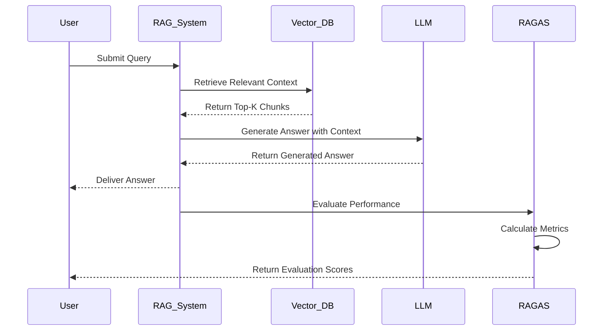

<div align="center">
  <h1> 🚀 RAG Benchmark System</h1>
  
  <br><br>
  <span style="zoom:1.3;">
    <a href="https://opensource.org/licenses/MIT"></a>
    <a href="https://www.python.org/downloads/"></a>
    <a href="https://openai.com/"></a>
    <a href="https://langchain.com/"></a>
    <a href="https://github.com/explodinggradients/ragas"></a>
    <!-- <a href="https://github.com/NicolasHoyosDevs/RAG-Benchmark/issues"></a>
    <a href="https://github.com/NicolasHoyosDevs/RAG-Benchmark/stargazers"></a>
    <a href="https://github.com/NicolasHoyosDevs/RAG-Benchmark/network/members"></a> -->
  </span>
</div>

A comprehensive benchmarking framework for evaluating Retrieval-Augmented Generation (RAG) systems using RAGAS metrics. This project implements and compares multiple RAG architectures including Simple Semantic RAG, Hybrid RAG (BM25 + Semantic), HyDE RAG, and Query Rewriter RAG.

---

*Evaluate and compare multiple RAG architectures with comprehensive RAGAS metrics*

## Table of Contents

- [Overview](#overview)
- [Quick Start](#quick-start)
- [Project Structure](#project-structure)
- [RAG Architectures](#rag-architectures)
- [Evaluation Metrics](#evaluation-metrics)
- [Usage](#usage)
- [Results and Analysis](#results-and-analysis)
- [Configuration](#configuration)
- [Customization](#customization)
- [Contributing](#contributing)
- [License](#license)


## Overview

RAG Benchmark System is a professional-grade benchmarking framework designed to evaluate and compare Retrieval-Augmented Generation (RAG) systems using industry-standard RAGAS metrics. Este proyecto implementa cuatro arquitecturas RAG distintas y provee herramientas de evaluación completas.



### Key Capabilities

- **Comprehensive Evaluation**: RAGAS metric-based evaluation with multiple GPT model support
- **Multiple Architectures**: Simple Semantic RAG, Hybrid RAG (BM25 + Semantic), HyDE RAG, Query Rewriter RAG
- **Complete Pipeline**: Data processing, embedding creation, vector storage, and automated evaluation
- **Advanced Analysis**: Performance comparison, model benchmarking, and JSON result exports

## Quick Start

### Prerequisites

- Python 3.8+
- OpenAI API key
- Git

### Installation

1. Clone the repository
```bash
git clone https://github.com/NicolasHoyosDevs/RAG-Benchmark.git
cd RAG-Benchmark
```

2. Install dependencies
```bash
pip install -r requirements.txt
```

3. Configure environment

Create a `.env` file in the root directory:
```bash
OPENAI_API_KEY=your_openai_api_key_here
```

4. Create embeddings
```bash
cd Data/embeddings
python create_embeddings.py
```

This will:
- Load text chunks from `Data/chunks/chunks_final.json`
- Create embeddings using OpenAI's text-embedding-3-small
- Store them in ChromaDB at `Data/embeddings/chroma_db/`

5. Run evaluation
```bash
cd ../..
python results/ragas_evaluator.py hybrid
```

## Project Structure

```
RAG-Benchmark/
├── Data/
│   ├── raw/                     # Raw documents
│   ├── processed/               # Processed documents
│   ├── chunks/                  # Text chunks (JSON)
│   ├── embeddings/              # Embedding creation and storage
│   │   ├── create_embeddings.py # Create embeddings script
│   │   ├── test_retrieval.py    # Test retrieval functionality
│   │   ├── view_embeddings.py   # View embedding data
│   │   └── chroma_db/          # ChromaDB vector database
│   └── parsed_docs/             # Parsed document files
├── Simple_Semantic_RAG/         # Simple semantic search RAG
│   └── simple_semantic_rag.py
├── Hybrid_RAG/                  # Hybrid BM25 + Semantic RAG
│   └── hybrid_langchain_bm25.py
├── HyDE_RAG/                    # Hypothetical Document Embeddings RAG
│   └── hyde_rag.py
├── Query_Rewriter_RAG/          # Query rewriting RAG
│   └── main_rewriter.py
├── results/                     # Evaluation results and analysis
│   ├── ragas_evaluator.py       # Main evaluation script
│   ├── utils.py                 # Utility functions
│   ├── ragas_analysis/          # Analysis tools and reports
│   └── [JSON files]             # Evaluation results
├── benchmark_ragas.py           # Benchmark script
├── test_comparison.py           # Comparison testing
├── requirements.txt             # Python dependencies
└── README.md                    # This file
```

## RAG Architectures

This project implements four distinct RAG architectures:

### 1. Simple Semantic RAG
- Uses semantic similarity search
- Direct retrieval from vector database
- Fast and straightforward approach
- Best for: Simple, direct queries

### 2. Hybrid RAG (BM25 + Semantic)
- Combines BM25 keyword search with semantic search
- Better retrieval accuracy for diverse queries
- Balances precision and recall
- Best for: Mixed keyword and semantic queries

### 3. HyDE RAG (Hypothetical Document Embeddings)
- Generates hypothetical documents for queries
- Uses embeddings of hypothetical content for retrieval
- Effective for complex or abstract queries
- Best for: Abstract or conceptual questions

### 4. Query Rewriter RAG
- Rewrites queries in multiple ways
- Performs multiple retrievals with different formulations
- Improves results for ambiguous queries
- Best for: Ambiguous or multi-faceted questions

## Evaluation Metrics

The system uses RAGAS (Retrieval-Augmented Generation Assessment) for comprehensive evaluation:

Metrics Evaluated:
- Faithfulness: How well the response matches the retrieved context
- Answer Relevancy: How relevant the answer is to the question
- Context Precision: Precision of retrieved context
- Context Recall: Recall of retrieved context

## Usage

### Individual RAG Evaluation

```bash
# Simple Semantic RAG
python results/ragas_evaluator.py simple

# Hybrid RAG
python results/ragas_evaluator.py hybrid

# HyDE RAG
python results/ragas_evaluator.py hyde

# Query Rewriter RAG
python results/ragas_evaluator.py rewriter
```

### Multi-Model Evaluation

```bash
# Evaluate Hybrid RAG with all models
python results/ragas_evaluator.py multi-model hybrid

# Evaluate Simple RAG with all models
python results/ragas_evaluator.py multi-model simple
```

### Comprehensive Evaluation

```bash
python results/ragas_evaluator.py all-models-all-rags
```

This command will:
- Test all 4 RAG architectures
- Use all 4 GPT models (gpt-3.5-turbo, gpt-4o, gpt-4o-mini, gpt-4)
- Generate 16 evaluation runs
- Create a consolidated JSON file with all results

### Other Commands

```bash
# Run benchmark script
python benchmark_ragas.py

# Run comparison tests
python test_comparison.py

# View embedding data
cd Data/embeddings
python view_embeddings.py

# Test retrieval functionality
cd Data/embeddings
python test_retrieval.py
```

## Results and Analysis

### Output Files
Results are saved in the `results/` directory as JSON files:
- `ragas_evaluation_[type]_[timestamp].json` - Individual evaluations
- `ragas_comprehensive_all_rags_all_models_[timestamp].json` - Complete evaluation

### JSON Output Structure

#### Individual RAG Evaluation
```json
{
  "metadata": {
    "rag_type": "hybrid",
    "model_used": "gpt-4o",
    "timestamp": "20250830_181136",
    "total_questions": 5,
    "evaluation_duration": "45.2s"
  },
  "rag_results": {
    "faithfulness": 0.85,
    "answer_relevancy": 0.78,
    "context_precision": 0.92,
    "context_recall": 0.76
  },
  "question_by_question": [...]
}
```

## Configuration

### Environment Variables
- `OPENAI_API_KEY`: Your OpenAI API key (required)

### Supported Models
- gpt-3.5-turbo
- gpt-4o
- gpt-4o-mini
- gpt-4

## Customization

### Adding New Documents
1. Place documents in `Data/raw/`
2. Process them into chunks
3. Update `Data/chunks/chunks_final.json`
4. Re-run embedding creation

### Modifying RAG Parameters
Edit the respective RAG files:
- `Simple_Semantic_RAG/simple_semantic_rag.py`
- `Hybrid_RAG/hybrid_langchain_bm25.py`
- `HyDE_RAG/hyde_rag.py`
- `Query_Rewriter_RAG/main_rewriter.py`

### Custom Evaluation Metrics
Modify `results/ragas_evaluator.py` to add custom metrics or evaluation logic.

## Contributing

1. Fork the repository
2. Create a feature branch
3. Make your changes
4. Add tests if applicable
5. Submit a pull request

## License

This project is licensed under the MIT License. See `LICENSE` for details.

## Support

- **Issues**: Create an issue on GitHub
- **Documentation**: This README and inline code comments
- **Community**: Check existing issues and discussions

## Example Usage

```python
# Example: Evaluate Hybrid RAG
from results.ragas_evaluator import RAGASEvaluator

evaluator = RAGASEvaluator()
results = evaluator.evaluate_rag("hybrid", "gpt-4o")
print(f"Faithfulness: {results['faithfulness']}")
print(f"Answer Relevancy: {results['answer_relevancy']}")
```

For more advanced usage, see the individual RAG implementation files and the evaluation script.
