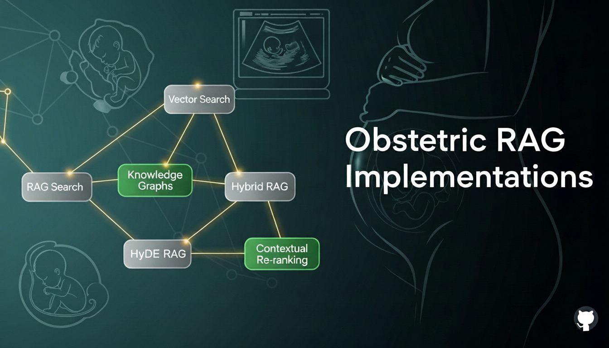
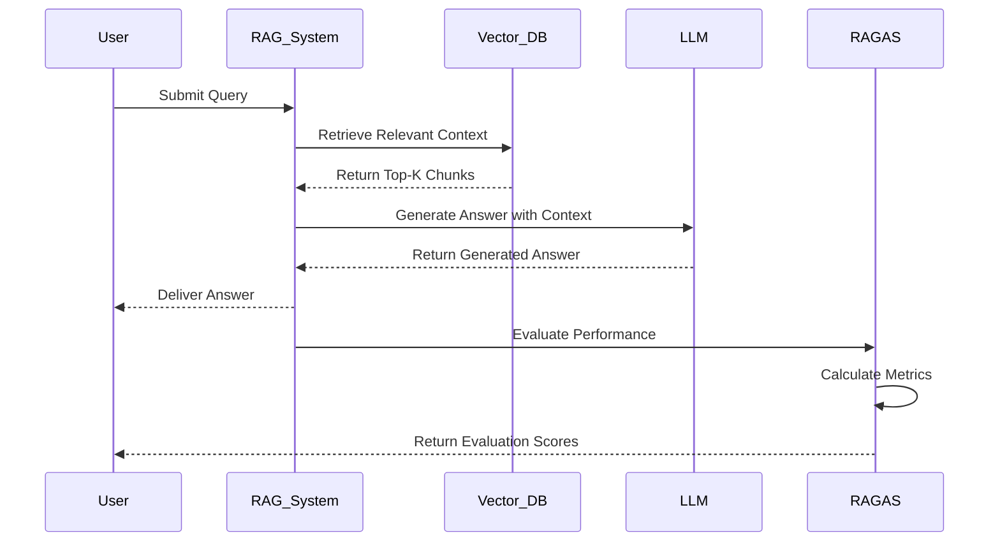

<div align="center">
  <h1> Obstetric RAG Research</h1>
  
  <br><br>
  <span style="zoom:1.3;">
    <a href="https://opensource.org/licenses/MIT"></a>
    <a href="https://www.python.org/downloads/"></a>
    <a href="https://openai.com/"></a>
    <a href="https://langchain.com/"></a>
    <a href="https://github.com/explodinggradients/ragas"></a>
    <!-- <a href="https://github.com/NicolasHoyosDevs/RAG-Benchmark/issues"></a>
    <a href="https://github.com/NicolasHoyosDevs/RAG-Benchmark/stargazers"></a>
    <a href="https://github.com/NicolasHoyosDevs/RAG-Benchmark/network/members"></a> -->
  </span>
</div>

A comprehensive research project comparing different Retrieval-Augmented Generation (RAG) techniques applied to medical question-answering in obstetrics. This work benchmarks multiple RAG architectures (Simple Semantic, Hybrid, HyDE, and Query Rewriter) across various Large Language Models (LLMs) and Small Specialized Language Models (SLMs) using RAGAS evaluation metrics.

---

*A comparative study of RAG techniques for obstetric medical Q&A: evaluation of retrieval strategies and large language model performance*

## Table of Contents

- [Overview](#overview)
- [Quick Start](#quick-start)
- [Project Structure](#project-structure)
- [RAG Architectures Compared](#rag-architectures-compared)
- [Evaluation Framework](#evaluation-framework)
- [Experimental Protocol](#experimental-protocol)
- [Results Storage and Analysis](#results-storage-and-analysis)
- [Research Configuration](#research-configuration)
- [Extending the Research](#extending-the-research)
- [Contributing to the Research](#contributing-to-the-research)
- [License](#license)


## Overview

This research project investigates the effectiveness of different Retrieval-Augmented Generation (RAG) strategies for medical question-answering in the obstetrics domain. We implement and evaluate four distinct RAG architectures using a corpus of pregnancy and childbirth medical guidance, comparing their performance across multiple state-of-the-art language models using the RAGAS evaluation framework.

**Research Focus:**
- Comparative analysis of RAG retrieval strategies (semantic, hybrid, hypothetical embeddings, query reformulation)
- Performance evaluation across multiple LLMs and specialized medical language models
- Assessment of retrieval quality metrics (precision, recall, faithfulness)
- Identification of optimal RAG configurations for medical Q&A scenarios



### Research Contributions

- **Systematic Evaluation**: RAGAS-based assessment of RAG architectures in medical domain
- **Multiple Architectures**: Comparison of Simple Semantic, Hybrid (BM25 + Semantic), HyDE, and Query Rewriter approaches
- **Model Diversity**: Evaluation across general-purpose LLMs and domain-specialized medical language models
- **Reproducible Benchmark**: Complete pipeline from data processing to evaluation with detailed results documentation

## Quick Start

### Prerequisites

- Python 3.8+
- OpenAI API key
- Git

### Installation

1. Clone the repository
```bash
git clone https://github.com/NicolasHoyosDevs/RAG-Benchmark.git
cd RAG-Benchmark
```

2. Install dependencies
```bash
pip install -r requirements.txt
```

3. Configure environment

Create a `.env` file in the root directory:
```bash
OPENAI_API_KEY=your_openai_api_key_here
```

4. Create embeddings
```bash
python scripts/create_embeddings.py
```

This will:
- Load text chunks from `data/chunks/chunks_final.json`
- Create embeddings using OpenAI's text-embedding-3-small
- Store them in ChromaDB at `data/embeddings/chroma_db/`

5. Run evaluation
```bash
python scripts/run_evaluation.py hybrid
```

## Project Structure

```
RAG-Benchmark/
├── src/
│   ├── rag/                     # RAG implementations (simple, hybrid, hyde, rewriter)
│   └── evaluation/              # RAGAS orchestration and reports
├── scripts/                     # CLI entrypoints (evaluation + embeddings)
├── data/
│   ├── raw/                     # Raw documents
│   ├── processed/               # Processed documents
│   ├── chunks/                  # Text chunks (JSON)
│   └── embeddings/              # ChromaDB persistent store
├── results/                     # Evaluation outputs (JSON)
├── docs/                        # Architecture and guides
├── config/                      # Project configuration files
├── requirements.txt             # Python dependencies
└── README.md                    # This file
```

## RAG Architectures Compared

This research compares four distinct RAG retrieval strategies, each representing different approaches to the retrieval problem in knowledge-augmented question-answering:

### 1. Simple Semantic RAG
- **Strategy**: Direct vector similarity matching
- **Hypothesis**: Dense embeddings alone provide sufficient retrieval quality
- **Characteristics**: Single-stage retrieval, computationally efficient
- **Use case in study**: Baseline for comparison

### 2. Hybrid RAG (BM25 + Semantic)
- **Strategy**: Ensemble of dense (semantic) and sparse (lexical) retrieval
- **Hypothesis**: Combining different retrieval signals improves coverage
- **Characteristics**: BM25 for keyword matching combined with semantic similarity
- **Use case in study**: Evaluating hybrid retrieval benefits

### 3. HyDE RAG (Hypothetical Document Embeddings)
- **Strategy**: Query expansion through hypothetical document generation
- **Hypothesis**: Generated relevant contexts improve embedding-based retrieval
- **Characteristics**: LLM-generated hypothetical answers used as retrieval queries
- **Use case in study**: Testing query-time expansion effectiveness

### 4. Query Rewriter RAG
- **Strategy**: Multi-formulation retrieval through query reformulation
- **Hypothesis**: Different query reformulations retrieve complementary contexts
- **Characteristics**: Generates multiple query variants for parallel retrieval
- **Use case in study**: Evaluating diversity through multi-modal reformulation

## Evaluation Framework

We employ RAGAS (Retrieval-Augmented Generation Assessment) as our primary evaluation framework. RAGAS provides automated, LLM-based metrics that assess both retrieval quality and generation quality without requiring manual annotations:

**Metrics Evaluated:**
- **Faithfulness**: Measures how much of the generated answer is grounded in the retrieved context (reduces hallucination)
- **Answer Relevancy**: Assesses whether the generated answer directly addresses the input question
- **Context Precision**: Evaluates the proportion of retrieved context that is relevant to the question
- **Context Recall**: Measures the completeness of retrieved relevant information from the knowledge base

These metrics enable comprehensive comparison across RAG architectures and models to identify which combinations produce the highest quality medical Q&A responses.

## Experimental Protocol

### Individual RAG Architecture Evaluation

Evaluate a single RAG architecture with a default LLM:

```bash
# Simple Semantic RAG
python scripts/run_evaluation.py simple

# Hybrid RAG (BM25 + Semantic)
python scripts/run_evaluation.py hybrid

# HyDE RAG
python scripts/run_evaluation.py hyde

# Query Rewriter RAG
python scripts/run_evaluation.py rewriter
```

### Multi-Model Evaluation

Compare performance across multiple language models for a specific RAG architecture:

```bash
# Evaluate all models with Hybrid RAG
python scripts/run_evaluation.py multi-model hybrid

# Evaluate all models with Simple RAG
python scripts/run_evaluation.py multi-model simple
```

### Comprehensive Benchmark

Run complete evaluation across all RAG architectures and all available models:

```bash
python scripts/run_evaluation.py all-models-all-rags
```

This produces complete comparison data showing:
- Performance of each RAG architecture
- Model-specific performance variations
- Cross-model consistency
- Optimal configuration identification

### Other Commands

```bash
# Run benchmark script
python benchmark_ragas.py

# Run comparison tests
python test_comparison.py

# View embedding data
python scripts/view_embeddings.py

# Test retrieval functionality
python scripts/test_retrieval.py
```

## Results Storage and Analysis

### Output Format
Evaluation results are saved as JSON files in the `results/` directory:
- `ragas_evaluation_[rag_type]_[timestamp].json` — Individual RAG architecture evaluation
- `ragas_comprehensive_all_rags_all_models_[timestamp].json` — Complete comparative benchmark

### Analysis Capabilities
Results can be analyzed to:
- Identify the most effective RAG architecture for medical Q&A
- Determine model-specific performance variations
- Assess retrieval quality across different strategies
- Generate comparative visualizations and statistical analysis

### JSON Output Structure

#### Individual Evaluation Results
```json
{
  "metadata": {
    "rag_type": "hybrid",
    "model_used": "gpt-4o",
    "timestamp": "20250830_181136",
    "total_questions": 5,
    "evaluation_duration": "45.2s"
  },
  "rag_results": {
    "faithfulness": 0.85,
    "answer_relevancy": 0.78,
    "context_precision": 0.92,
    "context_recall": 0.76
  },
  "question_by_question": [...]
}
```

## Research Configuration

### Environment Setup
- `OPENAI_API_KEY`: OpenAI API key for LLM and embedding model access (required)

### Language Models Evaluated
- **General-Purpose LLMs**: gpt-3.5-turbo, gpt-4o, gpt-4o-mini, gpt-4
- **Specialized Models**: (To be integrated) Medical-specialized language models for domain comparison

### Retrieval Configuration
- **Vector Database**: ChromaDB with persistent storage
- **Embedding Model**: OpenAI text-embedding-3-small
- **Default Retrieval**: k=5 chunks per query
- **Collection**: guia_embarazo_parto (obstetrics medical guidance)

## Extending the Research

### Adding New RAG Architectures
To evaluate a novel RAG strategy:
1. Implement the strategy in `src/rag/[new_rag_name].py`
2. Define the required `query_for_evaluation()` function compatible with the evaluation pipeline
3. Wire into `src/evaluation/ragas_evaluator.py`
4. Run comprehensive evaluations to compare against existing architectures

### Integrating Domain-Specialized Models
To evaluate medical-specialized language models:
1. Add model configuration to `src/common/model_provider.py`
2. Ensure model API compatibility with evaluation framework
3. Run multi-model evaluation to assess domain expertise benefits

### Modifying Retrieval Parameters
Experiment with different retrieval settings:
- Edit `src/rag/*.py` files to adjust retrieval count (k), reranking, or filtering strategies
- Document configuration changes in evaluation metadata
- Run comparative evaluations to measure parameter impact

### Customizing Evaluation Metrics
Extend `src/evaluation/ragas_evaluator.py` to:
- Add domain-specific evaluation metrics
- Implement human evaluation comparisons
- Generate detailed analysis and visualization reports

## Contributing to the Research

We welcome contributions that advance this research on RAG techniques for medical Q&A:

1. **New RAG Architectures**: Propose and implement novel retrieval strategies
2. **Model Integration**: Add new language models (especially domain-specialized medical models)
3. **Evaluation Extensions**: Propose additional metrics or analysis methods
4. **Documentation**: Document findings, parameter studies, or experimental observations
5. **Results & Analysis**: Contribute analysis, visualizations, or comparative insights

To contribute:
- Fork the repository
- Create a feature branch with descriptive name
- Document your changes and experimental methodology
- Submit a pull request with results summary and analysis

## License

This project is licensed under the MIT License. See `LICENSE` for details.

## Quick Reference

```python
# Example: Evaluate an individual question across RAG architectures
from src.evaluation.ragas_evaluator import RAGASEvaluator

evaluator = RAGASEvaluator()

# Evaluate Hybrid RAG with gpt-4o
hybrid_results = evaluator.evaluate_rag("hybrid", "gpt-4o")
print(f"Hybrid Faithfulness: {hybrid_results['faithfulness']}")
print(f"Hybrid Answer Relevancy: {hybrid_results['answer_relevancy']}")

# Compare with Simple RAG
simple_results = evaluator.evaluate_rag("simple", "gpt-4o")
print(f"Simple Faithfulness: {simple_results['faithfulness']}")
```

For detailed information on each RAG implementation and evaluation procedures, see the individual module files and the evaluation script.
